

   <h1 align="center">TivySkip - Web Extension</h1>

<h3 align="center">Adblock Live TV on any page</h3>

TivySkip is a Live TV adblocker for web with the ability to fast forward over ads, it also mutes the tab and blocks ad visuals from being seen for the duration of the adbreak.

This web extension works best on any page with a `<video/>` tag and in a limited way for embedded `<iframe/>` live videos. Compatible with Chrome and Firefox, tested on Vivaldi, Brave, LibreWolf. 

#### Who is this for?

For people who watch broadcast IPTV on random websites or from a USB DVB-T dongle piped to a browser and are tired of having to mute commercials in real-time, regularly forgetting to unmute when ads are over.

## Table of Contents

- [TivySkip](#tivyskip)
  - [Demo](#demo)
  - [Screenshots](#screenshots)
  - [Install](#install)
  - [Getting started](#getting-started)
  - [Additional notes](#additional-notes)
  - [How it works](#how-it-works)
  - [FAQ](#faq)
  - [Release notes](#release)
  - [How is this better than just muting ads myself?](#sell-me-on-this)
  - [Comparison to Alternative Live TV Adblock Extensions](#comparison)
  - [Sites compatible with TivySkip](#compat)

## Demo

<!-- drag and drop in edit readme mode to get user-image link -->
<!-- https://github.com/user-attachments/assets/947fdf4c-0c4a-46ef-bfdf-b34bd9584328 -->

https://github.com/user-attachments/assets/f7b1dacc-8806-4786-b7dd-553627c206e2

Fallback Tab Demo

<!-- https://github.com/user-attachments/assets/c1040d54-0bd7-4b53-b528-65b0acce40d3 -->
https://github.com/user-attachments/assets/597b0890-1640-48a8-845f-ab834d8ca0cf

## Screenshots

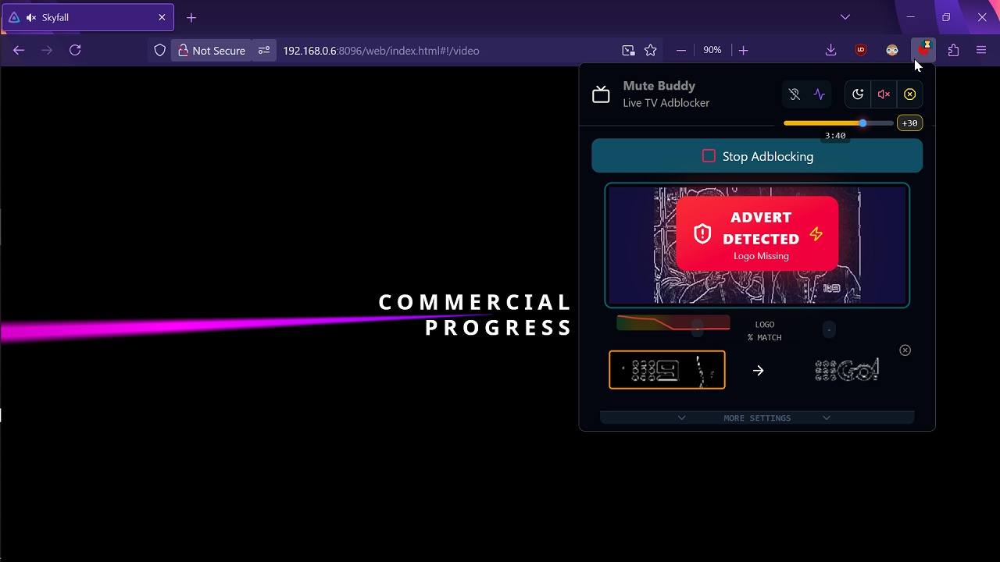

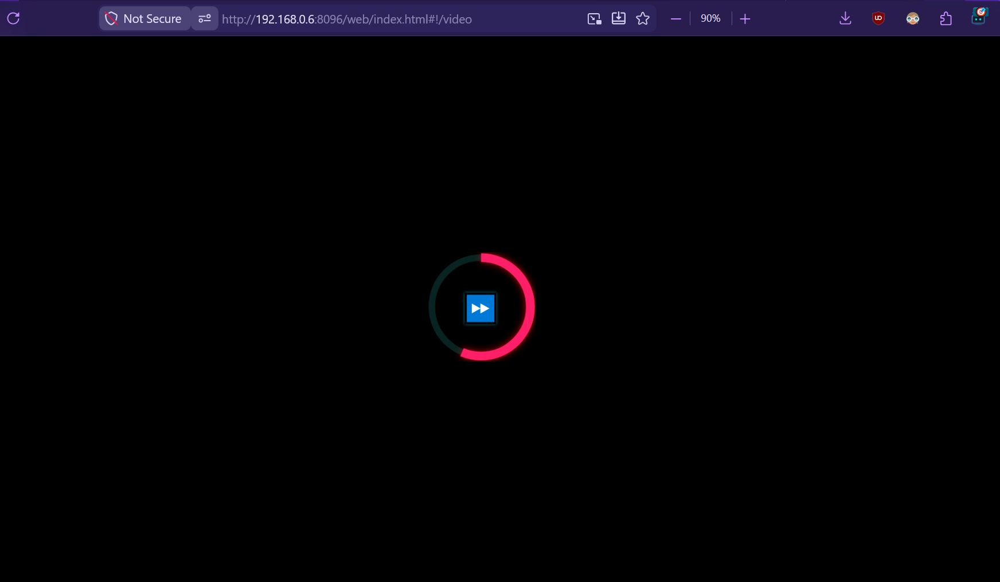

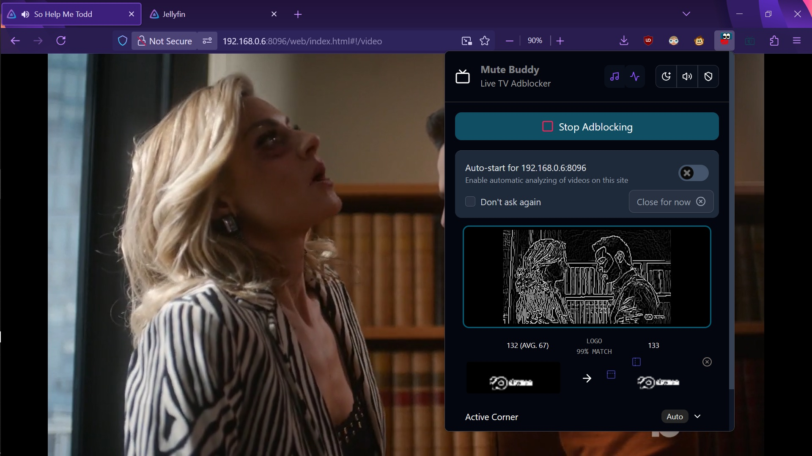

More Screenshots

  
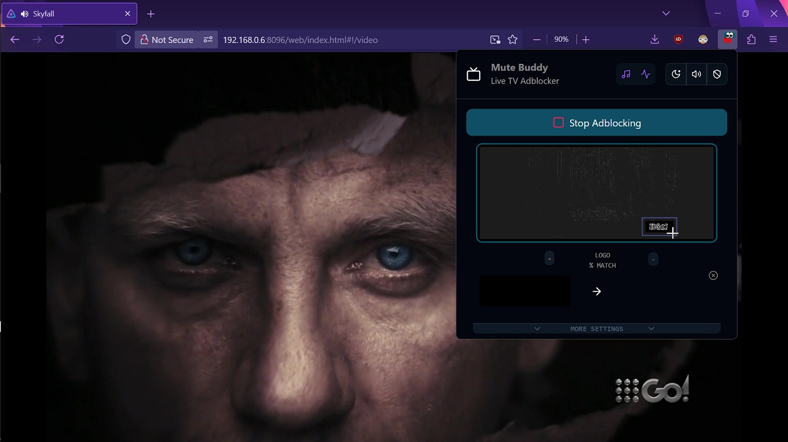

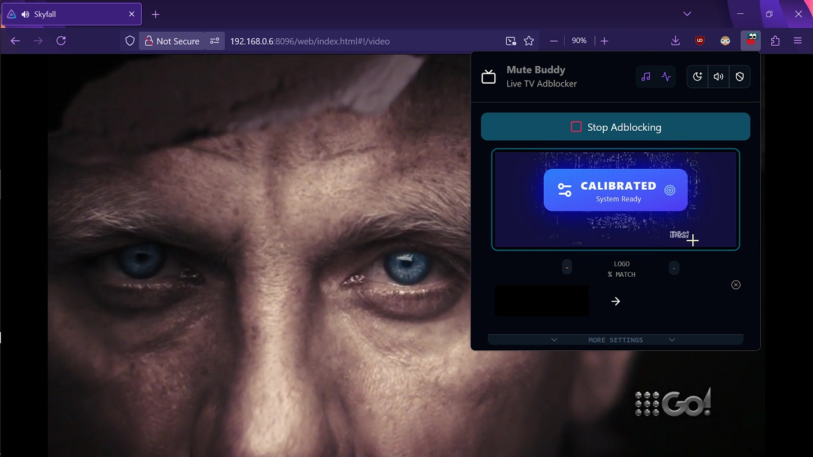

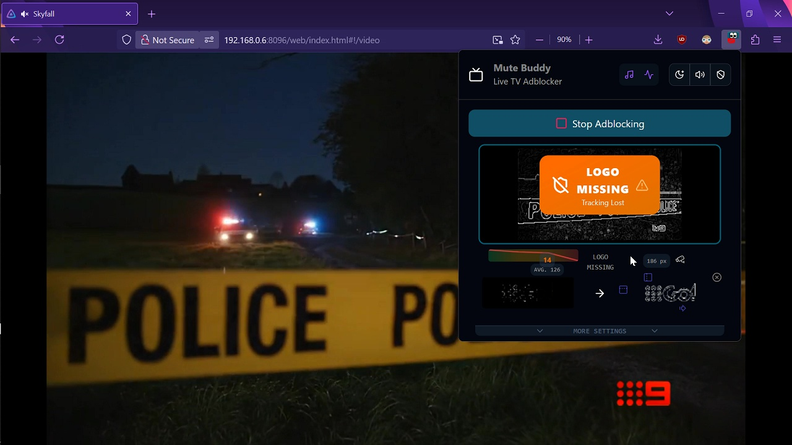

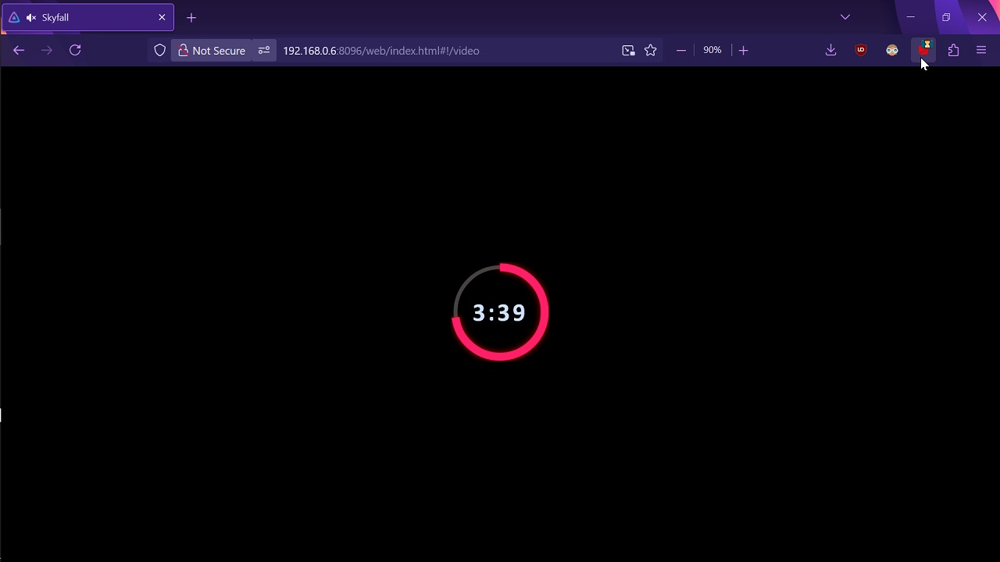

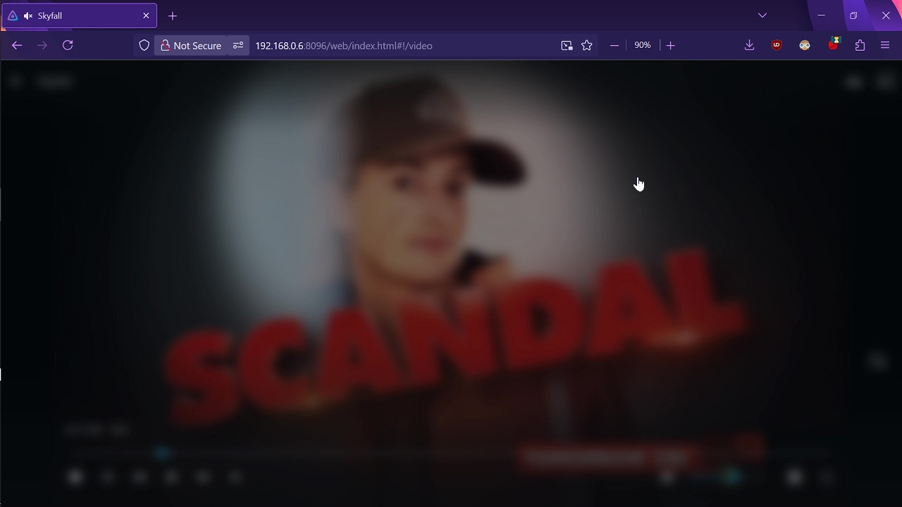

<!---->
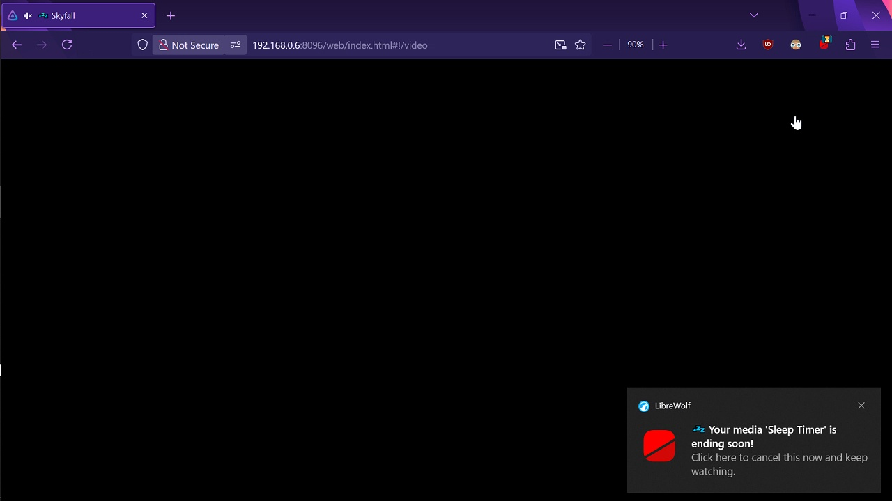

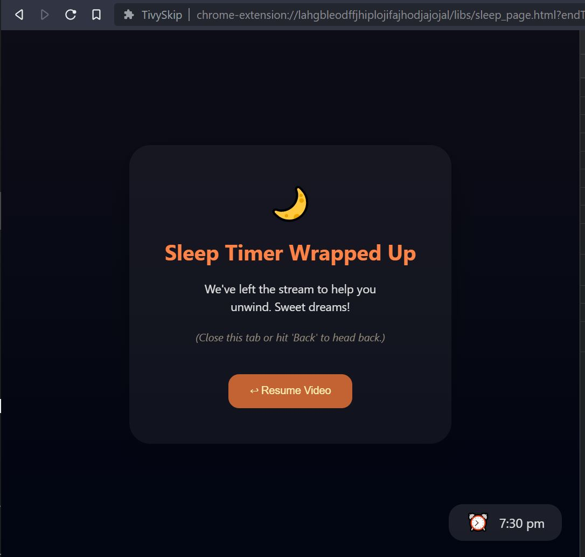

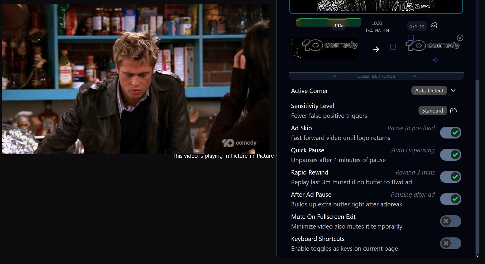

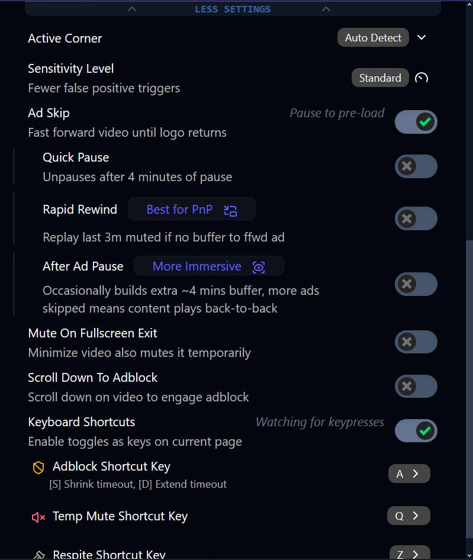

## Install

Install Latest Version from store:

- Firefox: https://addons.mozilla.org/en-US/firefox/addon/tivyskip
- Chrome: awaiting account approval, use pre-release install.

Manual Install:
- Firefox (official signed): [TivySkip_v1-1-2-firefox-signed.xpi](https://github.com/relaxo-player/TivySkip-extension/releases/download/1.1.2/tivyskip-1.1.2.xpi)
- Firefox (pre-release): [TivySkip_v1-1-2-firefox-unsigned.zip](https://github.com/relaxo-player/TivySkip-extension/releases/download/1.1.2/tivyskip-v1-1-2_firefox-unsigned.zip)
- Chrome (pre-release): [TivySkip_v1-1-2_chrome-unsigned.zip](https://github.com/relaxo-player/TivySkip-extension/releases/download/1.1.2/tivyskip-v1-1-2_chrome-unsigned.zip)

See all the [releases](https://github.com/relaxo-player/TivySkip-extension/releases/latest)

Install Pre-release Temporarily

  
1. Add the extension as a temporary addon by navigating to `"about:debugging"`
2. Click on `"This Firefox"` and `"Load Temporary Add-on..."`
3. Navigate to the folder where the extension is saved and double click on any file inside of the folder to import the addon

Unfortunately you will have to do this each time you restart firefox

Install Pre-release Permanently

  
With supported version of firefox nightly or developer, you can install the unsigned pre-release extension permanently by following these steps:

1. Navigate to `"about:config"`
2. Type `"xpinstall.signatures.required"` into the text field that shows up and set the value to `"false"`
3. Navigate to `"about:addons"`
4. Click on the little cog wheel icon and `"Install Addon from file..."`
5. Select the folder and you are done

This way you will not have to reinstall the extension each time you restart your browser.

## Getting started

- Navigate to a page where live broadcast TV is playing in a basic `<video/>`
  - e.g. https://tvpass.org/channel/bbc-america-east
- Click on the TivySkip button in the extension toolbar and click Start Adblocking.
- Notice the video frames being edge traced in the viewbox and see how it automatically detects the broadcast logo of the video and how accurately it redetects each few seconds.
- Drag the mouse in the viewbox to manually highlight the exact base logo if needed
- Enable all AdSkip settings for best results or none if you just want simple live adblocking with muted blackout overlay

## Additional notes

- Designed for one primary feed and one Fallback Tab max, we suggest you find content without ads to use as fallback.

> [!WARNING]
>
> Multiple streams cannot be adblocked at the same time yet.

#### Embedded iframe video quirks:

- Adskipping unavailable
- Don't scroll the page much as the extension is taking screenshots of the visible page to do regular logo matching.
- Right-click the page to load the target iframe in it's own tab to better detect and manipulate the true `<video/>`

## How it works

The extension auto discovers any longstanding broadcast logos in the feed and when it is gone that signals ads are playing and so the tab is muted and a black overlay applied for the duration of the adbreak (or ads are skipped). The logo mask rebuilds each page load, fully automatically, but you can also finely select the exact parts of the logo on screen to watch for using the viewfinder. When the logo is no longer detected that triggers the blackout overlay timer toggle automatically OR you can engage the timers manually via the keyboard shortcut (key A). 

> [!NOTE]
>
> No external API calls or AI is used, and no login required. Extension uses a light weight built-in computer vision library. 

This system is extremely accurate for solid logos and works very well for transparent logos (change sensitivity to low if not working well).

#### How AdSkip Works

You start watching live TV normally. When ads happen there is no forward buffer available to skip through so the extension smartly manages this cache for you. 

1. **Rapid Rewind** 3-5 minutes to build up enough buffer
     - The user sees the same content they just saw on the screen replay without sound
     - If that is undesirable:
       * disable Rapid Rewind, or
       * set a **Fallback Tab** to briefly play other content, or
       * look away during this rewind/replay time, or
       - click the notification or open extension to "UNDO REWIND"
2. Now after a few mins with enough buffer built up **AdSkip** can fast forward over the entire ad break until the start of the next content block.
     - if watching Picture-in-Picture notice that very little ad visuals had to be endured compared to basic ad muting.
     - "UNDO FAST FORWARD" via notification or in extension drop down
3. At the point where content returns we can do a strategic **Temporary Pause** (optional) for a few mins thereby building up even more time buffer so that **Rapid Rewind** is not needed as much next adbreak: 
     - The user does not have to wait for pause timer to complete, here the user can simply press play when ready and endure slightly more/less rewind time next adbreak to his liking.

This way two blocks of content can play back-to-back for better immersion and less cliff hangers. But it always catches up to live eventually. Alternatively you can simply pause for a very long time (15 minutes) to get maximum adskip over an hour but risk losing the cached up content to streaming/buffering/page load issues. 

## FAQ

See https://github.com/relaxoplayer/tivyskip-extension/blob/master/faq.md

## Release notes

### 1.1.2

    * More accurate blackout overlay for iframes
    * Better keyboard shortcuts for manual activation and timer adjustment.
    * Improvements to auto pause buffer build up timer feature
    
### 1.1.1

    * "Mute on fullscreen exit" setting - for manual adblocking when auto is unavailable
    * Better sleep timer defaults
    * Renamed extension to "TivySkip" as Mute Buddy was underselling the main capabilities of the extension
    * Better false positive logo drop detection
    * Faster ad skipping

## Can't I Just mute ads and skip around myself?

Sure, though we've automated it into a cohesive extension so no need to focus and work so hard every 8-12 minutes. You can start watching right away and
regularly ingest 24 minutes of content at once just by waiting occasionally.

- Muting and unmuting ads - and blacks out the feed during ads, showing estimated time remaining if you wiggle the mouse or tap the overlay
- Fastforwarding ads or pausing & rewinding a bit - builds up video cache for more immersive viewing without showing advert visuals while in PnP mode
- Switching tabs, playing substitute content if desired

## TivySkip Alternatives

https://github.com/RG-O/YoutubeOverCommercials - Live Commercial Blocker - latches on to single pixel of solid logo only reliable for some sports not all regular TV with semi-transparent logos

https://github.com/jrauser/hush - manual AI training required to tell it what regular content style looks like, heavy on resources and requires companion to install on PC. Not limited to broadcast TV though.

## Websites/projects compatible with TivySkip

- Jellyfin IPTV web player
- tvpass(dot)org  and [pleyr.net](https://pleyr.net/en/play)
- Popular iptv streaming players like jplayer etc.
- pretty much any video library the page uses with or without the timeline available so long as it uses the standard `<video/>` tag and is not inside an `<iFrame/>`

## Privacy Policy

See https://github.com/relaxoplayer/tivyskip-extension/blob/master/privacy.md

Suggestions are welcome :)
